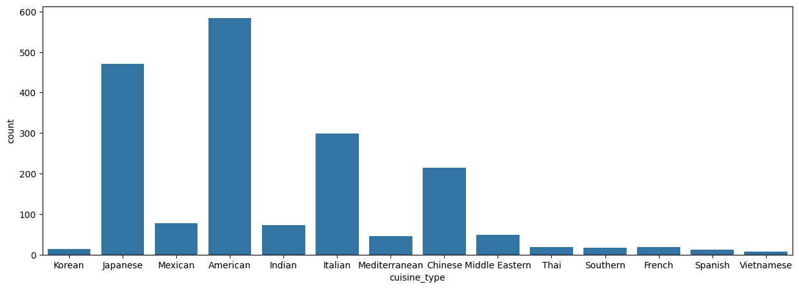
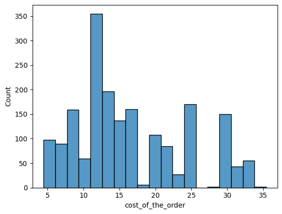
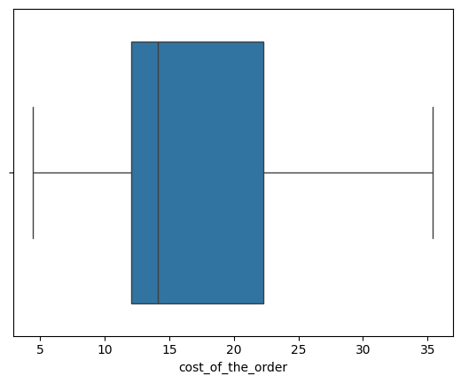
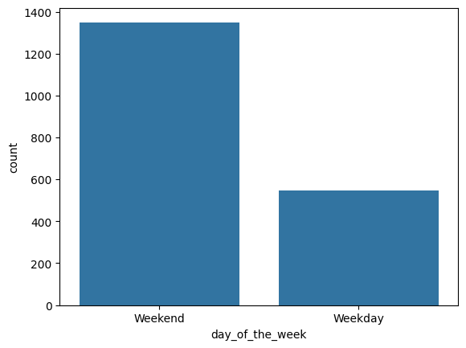
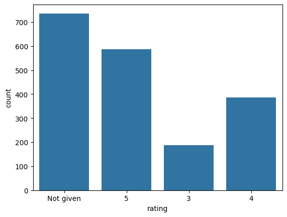
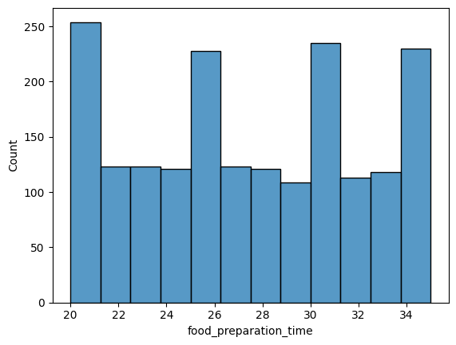

# FoodHub Exploratory Data Analysis

## Overview
This repository contains a reproducible ML/data analysis project with notebook, HTML report, dataset, and extracted visuals.

## Project Structure
- `data/` – dataset(s)
- `notebooks/` – Jupyter notebook(s)
- `reports/` – HTML report(s)
- `images/` – images extracted from the HTML report
- `requirements.txt` – Python dependencies

## How to Run
Install dependencies:

    pip install -r requirements.txt

Open the notebook in `notebooks/` or view the HTML report in `reports/`.

## Links
GitHub: https://github.com/sohailharoon777/foodhub-data-analysis

## Report Snapshots

